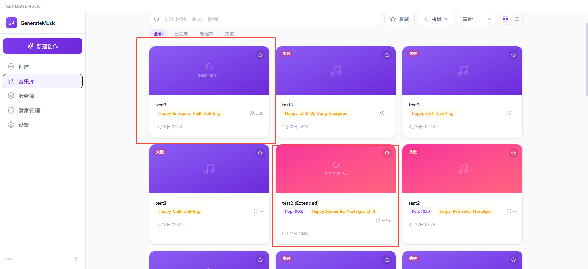

<div align="center">

# GenerateMusic

**AI 驱动的本地音乐生成桌面应用**

用一句话描述你想要的歌曲，GenerateMusic 为你完成作词、演唱、编曲和封面设计 —— 一切都在本地运行。

[](LICENSE)
[](https://www.python.org/)
[](https://tauri.app/)
[](https://react.dev/)

</div>

---

## 界面预览

### 创作页面

精细控制歌词、曲风、情绪、速度、调式、乐器和时长，AI 辅助生成歌词与标题。


### 音乐库

浏览、搜索、收藏和管理所有 AI 生成的音乐作品，支持网格/列表视图切换。



---

## 功能特性

- **简单模式** — 一句话描述，AI 自动完成作词、取名、编曲、演唱
- **自定义模式** — 精细控制歌词、曲风、情绪、速度、调式、乐器和时长
- **真人演唱** — ACE-Step v1.5 生成带有真实人声的歌曲，支持中、英、日、韩等多语言
- **最长 10 分钟** — 从 30 秒短片段到 10 分钟完整歌曲
- **AI 辅助创作** — LLM 自动生成歌词、推荐风格、创作标题
- **续写 & 混音** — 对已有歌曲进行续写延伸或风格混音
- **封面生成** — LLM 多模态自动生成专辑封面
- **音乐库** — 浏览、搜索、收藏和管理所有生成作品
- **中英双语界面**
- **本地优先** — 所有音乐生成在你的硬件上运行（CPU / GPU / Apple Silicon）

## 技术栈

| 层级 | 技术 |
|------|------|
| 桌面端 | Tauri 2 + React 19 + TypeScript |
| UI | Tailwind CSS 4 + Framer Motion |
| 状态管理 | Zustand 5 |
| 音频可视化 | wavesurfer.js 7 |
| 后端 | FastAPI + SQLAlchemy（异步 SQLite） |
| 音乐 AI | ACE-Step v1.5（DiT + VAE，Apple Silicon 支持 MLX 加速） |
| LLM | OpenRouter（Claude、GPT 等）via LangChain |
| 包管理 | uv（Python）+ bun（Node） |

## 快速开始

### 环境要求

- Python 3.12+
- Node.js 18+ 和 [bun](https://bun.sh/)
- [uv](https://docs.astral.sh/uv/) 包管理器
- Rust 工具链（用于 Tauri 构建）

### 安装

```bash
# 克隆项目
git clone https://github.com/LordFoxFairy/GenerateMusic.git
cd GenerateMusic

# 安装 Python 依赖
uv sync

# 安装 ACE-Step 音乐生成模型（推荐）
uv sync --extra ace-step

# 安装前端依赖
cd desktop && bun install && cd ..
```

或一键安装：

```bash
make install
```

### 配置

#### 1. 设置环境变量

在项目根目录创建 `.env` 文件：

```bash
OPENROUTER_API_KEY=sk-or-...
```

> 如果在中国大陆，可额外配置 HuggingFace 镜像加速模型下载：
> ```bash
> HF_ENDPOINT=https://hf-mirror.com
> HF_HUB_ENABLE_HF_TRANSFER=1
> ```

#### 2. 编辑 `backend/config.yaml`

```yaml
llm:
  providers:
    - name: openrouter
      type: openrouter
      base_url: https://openrouter.ai/api/v1
      api_key: ${OPENROUTER_API_KEY}
      models:
        - anthropic/claude-sonnet-4
  router:
    default: openrouter:anthropic/claude-sonnet-4

music:
  providers:
    - name: acestep-official
      type: acestep
      label: official
      models:
        - name: ace-step-v1.5
          model_kwargs:
            config_path: acestep-v15-turbo
            device: auto
            use_mlx_dit: true   # Apple Silicon MLX 加速
  router:
    default: acestep-official:ace-step-v1.5
```

### 启动

```bash
# 一键启动后端 + 桌面端
make dev
```

也可以分开启动：

```bash
make backend    # 后端：http://localhost:23456
make frontend   # 前端：http://localhost:1420（浏览器调试）
make tauri      # Tauri 桌面端（含前端）
```

## 音乐模型

| 模型 | 类型 | 人声 | 最大时长 | 说明 |
|------|------|------|----------|------|
| **ACE-Step v1.5**（默认） | `acestep` | 支持 | 10 分钟 | DiT 扩散 + VAE，Apple Silicon 支持 MLX 加速 |
| MusicGen | `huggingface` | 不支持 | ~30s | Meta 纯音乐模型 |
| Stable Audio Open | `huggingface` | 不支持 | ~47s | Stability AI |
| DiffRhythm | `huggingface` | 支持 | ~45s | 节奏扩散模型 |
| HeartMuLa | `huggingface` | 支持 | ~30s | 多语言歌曲模型 |

### ACE-Step 模型下载

ACE-Step 由多个子模型组成，可在应用内 Marketplace 页面下载，也可通过命令行手动下载：

```bash
# 主模型（必需，~10 GB）
huggingface-cli download ACE-Step/Ace-Step1.5

# 语言模型（按需选择一个）
huggingface-cli download ACE-Step/acestep-5Hz-lm-0.6B   # 0.6B 轻量版，~1.2 GB
huggingface-cli download ACE-Step/acestep-5Hz-lm-4B      # 4B 高质量版，~8 GB

# DiT 变体（可选）
huggingface-cli download ACE-Step/acestep-v15-sft            # SFT 高质量 50-step
huggingface-cli download ACE-Step/acestep-v15-base           # Base 适合微调
huggingface-cli download ACE-Step/acestep-v15-turbo-shift1   # Turbo Shift1
huggingface-cli download ACE-Step/acestep-v15-turbo-shift3   # Turbo Shift3
```

> **中国大陆用户**：如果下载速度慢，确保 `.env` 中配置了镜像：
> ```bash
> HF_ENDPOINT=https://hf-mirror.com
> ```

### ACE-Step 性能参考（Apple Silicon M 系列）

| 歌曲时长 | DiT 扩散 | VAE 解码 | 总耗时 |
|----------|----------|----------|--------|
| 60s | ~4s | ~6s | ~10s |
| 240s（4 分钟） | ~19s | ~14s | ~35s |

## 项目结构

```
GenerateMusic/
├── backend/                    # Python 后端
│   ├── app/
│   │   ├── api/endpoints/      # REST 接口
│   │   ├── providers/
│   │   │   ├── music/          # 音乐生成（ACE-Step, HuggingFace）
│   │   │   ├── llm/            # LLM 提供者（OpenRouter 等）
│   │   │   └── manager/        # 提供者路由与生命周期管理
│   │   ├── services/           # 业务逻辑（生成、LLM、存储）
│   │   ├── schemas/            # Pydantic 请求/响应模型
│   │   ├── repositories/       # 数据访问层
│   │   └── models/             # SQLAlchemy ORM 模型
│   ├── storage/                # 生成的音频和封面文件
│   └── config.yaml             # 提供者配置
├── desktop/                    # Tauri + React 桌面前端
│   └── src/
│       ├── pages/              # 页面：创作、音乐库、提供者、设置
│       ├── components/         # UI 组件
│       ├── stores/             # Zustand 状态管理
│       ├── services/           # API 客户端
│       ├── hooks/              # 自定义 Hooks
│       └── i18n/               # 国际化（中文、英文）
├── tests/                      # 测试
├── Makefile                    # 构建和运行命令
└── pyproject.toml              # Python 项目配置
```

## 常用命令

| 命令 | 说明 |
|------|------|
| `make dev` | 一键启动后端 + Tauri 桌面端 |
| `make backend` | 仅启动后端 |
| `make frontend` | 仅启动前端（浏览器调试） |
| `make tauri` | 启动 Tauri 桌面端 |
| `make install` | 安装所有依赖 |
| `make lint` | 代码检查（ruff + eslint） |
| `make fmt` | 格式化 Python 代码 |
| `make build-tauri` | 构建桌面端发行版 |
| `make clean` | 清理构建产物 |

